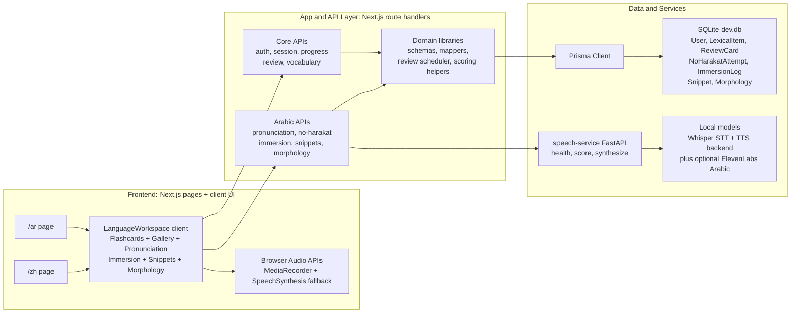
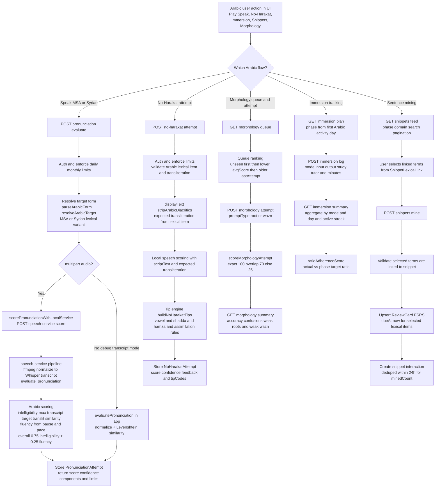

# Language Learning MVP Architecture Diagrams

If your VS Code Markdown Mermaid preview still fails, open these raw Mermaid files directly:
- `docs/architecture-overall.mmd`
- `docs/arabic-logic.mmd`

## 1) Overall App Architecture

## 2) Arabic Module Algorithms / Logic / Scoring

